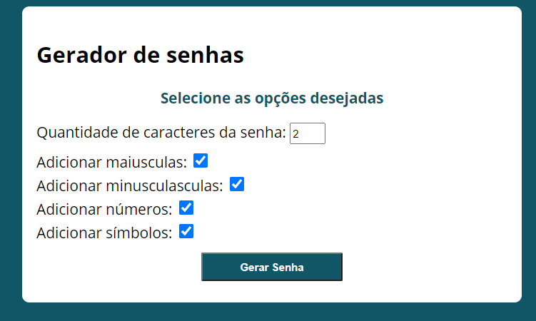
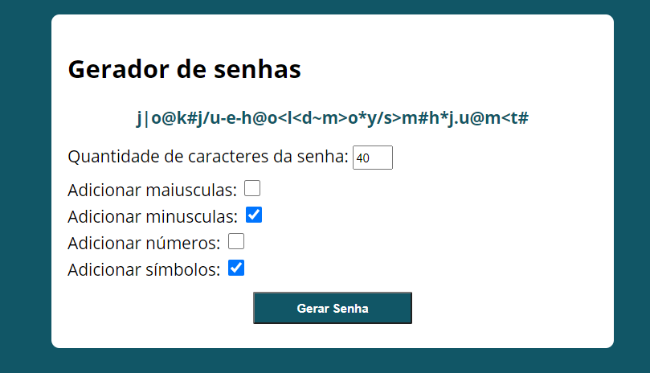

# gerador_senhas
Esse projeto utiliza JavaScript, e os conceitos de classe e modularização, além do Webpack para criar senhas por meio de critérios estabelecidos pelo usuário 

## Minha aplicação:
  

## Sobre a aplicação:

Essa aplicação sintetiza uma senha de 0 a 50 caracteres aleatórios por meio de regras que o usuário pode pré-estabelecer,
as regras são: senhas com somente caracteres maiúsculos, senha com somente caracteres minúsculos, senha somente com números ou senhas apenas com 
caracteres especiais. Esse sistema utiliza o conceito de Webpack para dividir suas funcionalidades em módulos o que facilita a compreensão do código e 
a solução de bugs, além de tornar o pojeto mais acessível para navegadores antigos.

## Por que essa aplicação?

Projeto construído para se praticar o conceito de classe e modularização, além de acrescentar funcionalidades ao meu portfólio pessoal.

Ficaria feliz com feedbacks:

E-mail: raphaeldesousalm@gmail.com  
linkdin: https://www.linkedin.com/in/raphaellima98/
